## Screenshots

<details>
<summary><strong>📸 View Application Photos</strong></summary>

### Contacts Manager

Main contacts page with contact information, CRUD actions, search, filtering, and export options.

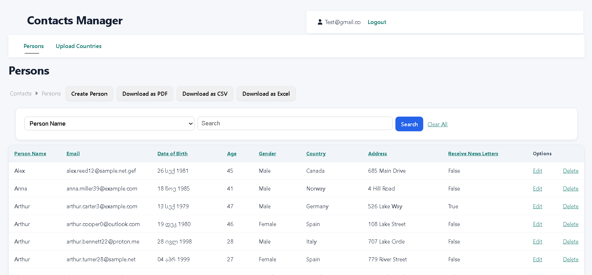

### Search Options

Available fields for searching and filtering contacts.

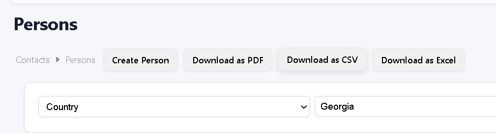

### Search List

Search field selection and search interface.

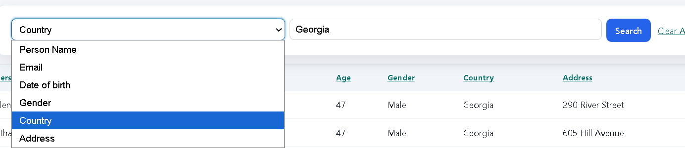

### Filtered Contacts

Example of filtering contacts by country.

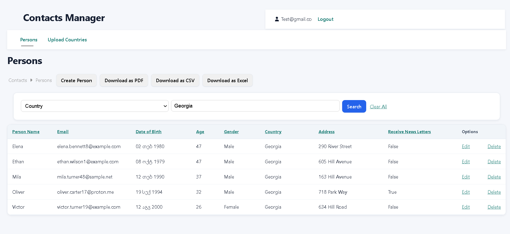

### Export Contacts as PDF

Contacts exported to a PDF document.

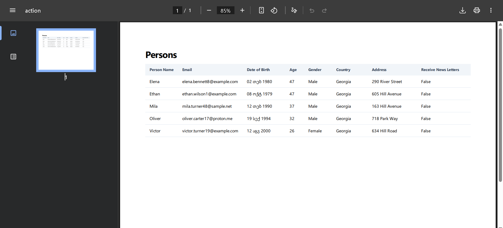

### Export Contacts as Excel

Example of exported contact data in Excel.

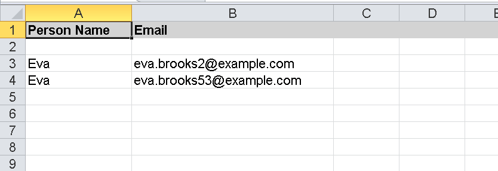

### User Login

Login page for authenticated users.

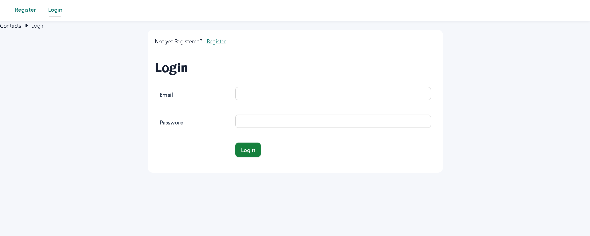

### Login Validation

Example of login validation when invalid credentials are submitted.

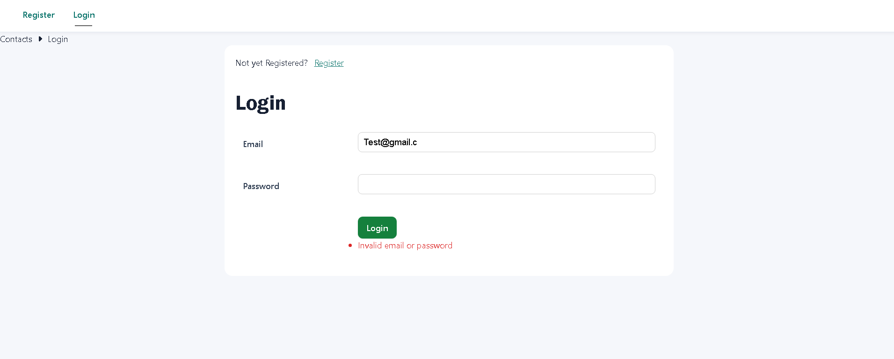

### User Registration

Registration form with User/Admin role selection.

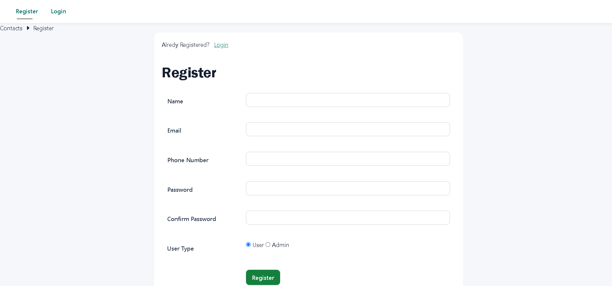

### Registration Validation

Registration form validation for invalid or missing input.

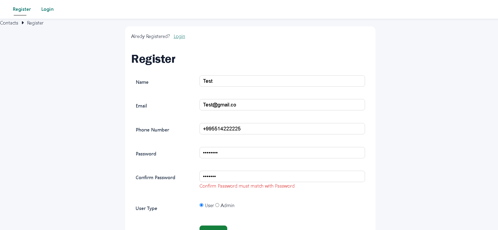

### Registration Validation Examples

Additional registration validation scenarios, including password and phone-number validation.

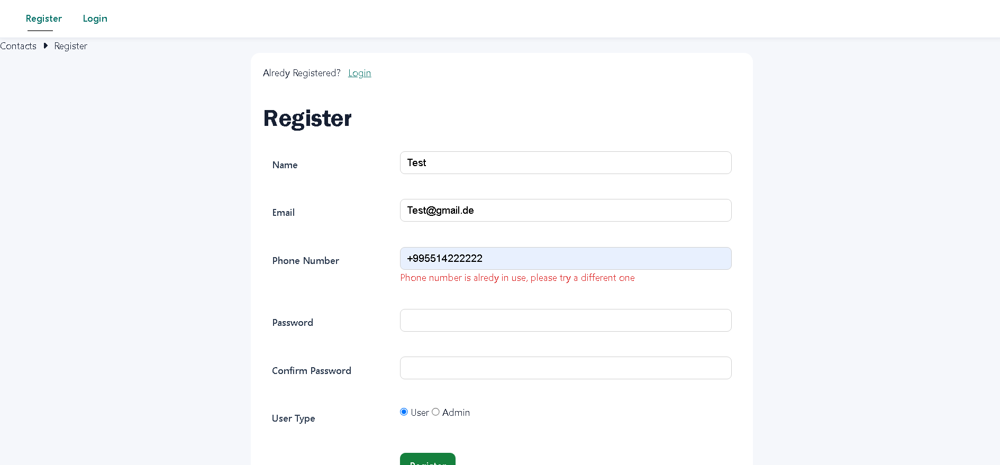

### Asynchronous Registration Validation

Asynchronous AJAX validation during user registration.

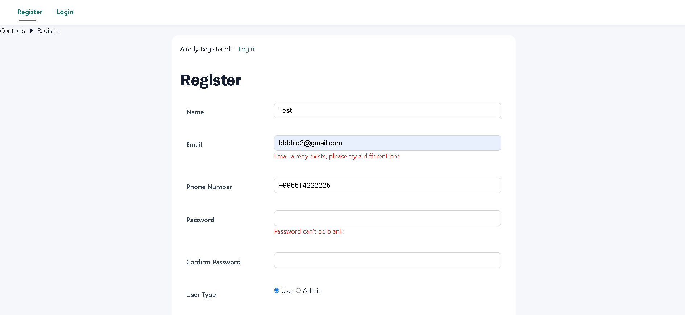

### Upload Contacts from Excel

Upload contacts from an Excel file directly through the application.

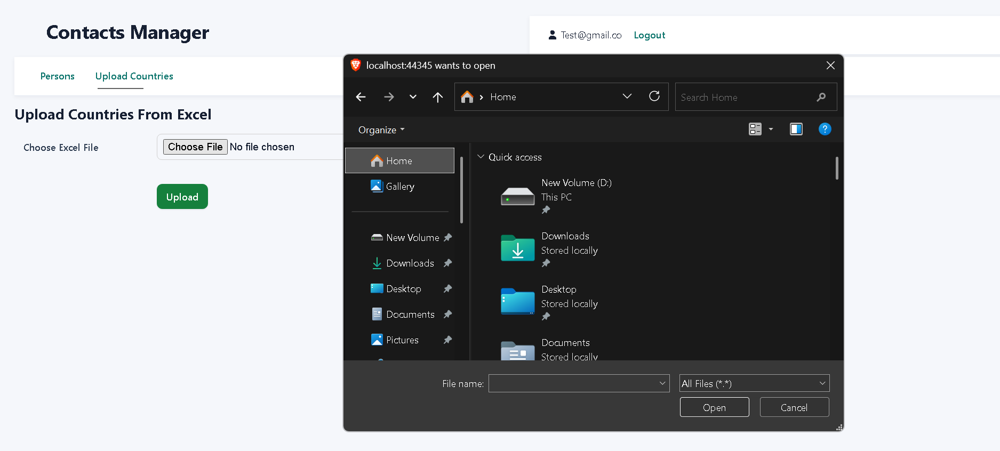

### Error Handling

Custom error page displayed when an application error occurs.

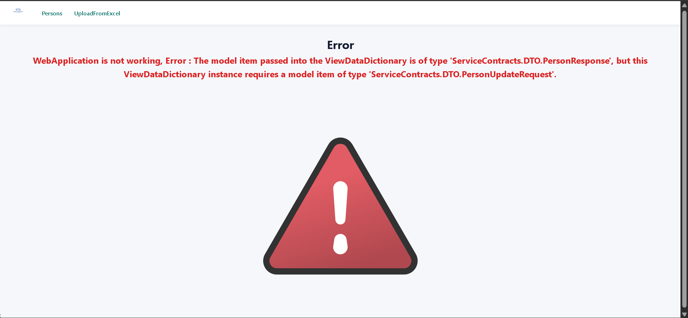

</details>

## Database

The application uses **SQL Server** with **Entity Framework Core** for database operations.

The application supports typical CRUD operations:

```text
Create → Read → Update → Delete
```

## Security

The application includes several security measures:

- **HTTPS** – The application is configured to use HTTPS for secure communication.
- **CSRF Protection** – Anti-forgery protection is implemented to help prevent **Cross-Site Request Forgery (CSRF)** attacks.
- **Authentication & Authorization** – Protected pages require authentication, with support for role-based authorization.
- **Input Validation** – User input is validated on both the client and server sides.

## Authentication & Authorization

Authentication and authorization are implemented using **ASP.NET Core Identity**.

The application supports:

- User registration
- Login/logout
- Role-based authorization
- User and Admin roles
- Protected application pages
- Validation of registration and login data
